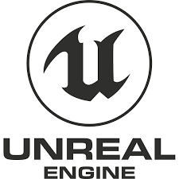

## Contenido

\tableofcontents

# E-adventure

## Logo

{ width=60% }\ 

## Ventajas

1. Facil de aprender
2. Desarrollo intuitivo y rapido
3. Ideal para protoripar

## Inconvenientes

1. Poco potente
2. Poco versatil
3. Oferta limitada de herramientas

# Unity3D

## Logo

{ width=60% }\ 

## Ventajas

1. Facil de aprender
2. Versatil
	1. Ofrece un asset store muy completo (plugins, graficos,...)
3. Potente

## Inconvenientes

1. Necesita de conocimientos informáticos.
2. Limitaciones para desarrollar proyectos complejos.

# Unreal Engine

## Logo

{ width=60% }\ 

## Ventajas

1. Versatil
2. Potente
3. Perfecta para equipos grandes

## Inconvenientes

1. Necesario de conocimientos amplios sobre desarrollo de videojuegos además de informáticos.
2. Complejo de desarrollar
3. Limitaciones para juegos con muchos objetos en la escena.
